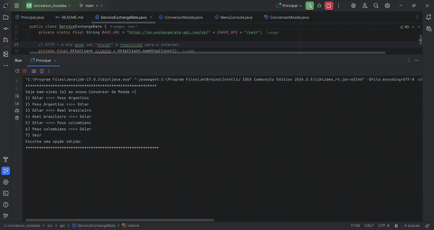

# Conversor de Moedas 💱
Projeto Java que consome a API [ExchangeRate API](https://www.exchangerate-api.com/) para converter valores entre diferentes moedas. Desenvolvido como desafio prático para aplicar conceitos de APIs, orientação a objetos e interface de console.

## 🚀 Funcionalidades

- Conversão entre diferentes moedas
- Consulta de taxa de câmbio em tempo real
- Interface no terminal
- Tratamento de erros de API e entrada
- Código modular com boas práticas

 ## 🛠 Tecnologias utilizadas

- Java 17+
- API REST (ExchangeRate)
- `HttpClient` e `Gson`
- IntelliJ IDEA
- Git + GitHub

 ## 📂 Estrutura do projeto
````
conversor_moedas/
├── interfaceusuario/ 👤 Interação com o usuário
├── modelo/ 📄 Dados da conversão (record)
├── servico/ 🔧 Lógica e integração com a API
└── README.md

````
## 🧪 Como executar

1. Clone o repositório:
   ```bash
   git clone git@github.com:JuRSouza/conversor-moedas.git

2. Abra o projeto no IntelliJ

3. Adicione a biblioteca Gson no projeto

4. Execute a classe MenuConsole e siga o menu no console.


 ## ✨ Demonstração
 



 
